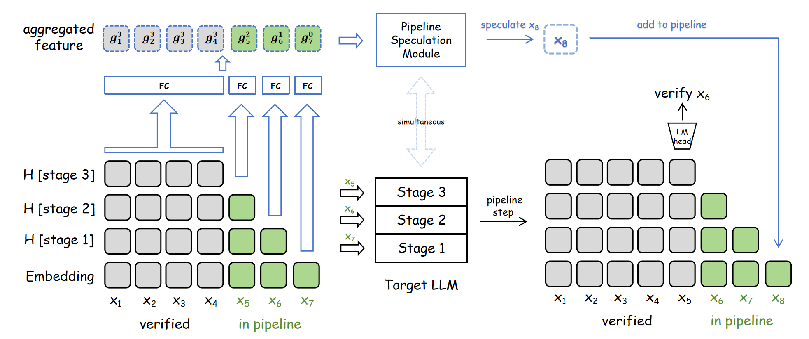

# Speculative Pipeline Decoding

Original implementation of [**Speculative Pipeline Decoding: Higher-Accruacy and Zero-Bubble Speculation via Pipeline Parallelism**](https://arxiv.org/abs/2605.30852). This is a novel speculative decoding paradigm, expected to address the issues of increasing difficulty and latency bubbles in traditional SD. Compatible with Qwen3, Qwen3.5, Llama3.1, etc. The target model runs in a multi-stage pipeline while a lightweight speculation head drafts tokens in parallel; drafts are verified against the base model for lossless generation. This paradigm is totally different from the traditional speculative decoding, and achieves higher acceptance rate and zero latency bubble.

> **Important**
>
> The **single-process** scripts (`pipeline_inference.py`, `eval.py`) are intended to **demonstrate algorithmic correctness** and report theoretical speedup from per-stage GPU timers. They are not tuned for production and can be **slower than standard autoregressive decoding** on one GPU because of Python-side sequential overhead.
>
> For **real multi-GPU wall-clock benchmarks** (prefill/decode tok/s, acceptance on bundled datasets), use [`distributed_inference/`](distributed_inference/) with `torchrun` — see [Distributed inference](#distributed-inference-real-speed-benchmarks).

## Method overview

The architecture of Speculative Pipeline Decoding when the number of stages is 3. The target LLM is partitioned into 3 stages. At the start point of this round, tokens (e.g., $x_5$ to $x_7$) reside in the pipeline at varying depths while others (e.g., $x_1$ to $x_4$) are fully processed tokens. For each token, hidden states from passed stages are projected via FC layers to form an aggregated feature, serving as the input to the Pipeline Speculation Module. The Speculation Module speculates the next token ($x_8$) simultaneously with the target LLM's pipeline forward step. Then $x_8$'s token embedding is added to the pipeline for the next round, while the target LLM verifies the oldest token in the pipeline ($x_6$) based on ground-truth output logits of the token $x_5$ that is just popped out of the pipeline.

## Repository layout

```
speculative_pipeline_decoding/
├── pipeline_model.py           # Qwen3SpeculativePipelineModel + speculation head
├── train.py                    # Train the speculation head
├── pipeline_inference.py       # Load checkpoint, run pipeline / HF generate (single GPU)
├── eval.py                     # Benchmark on bundled eval sets (theoretical speedup)
├── distributed_inference/      # Multi-GPU torch.distributed inference (real wall-clock)
├── old_version_v10/            # Archived earlier implementation
├── eval_data/                  # MT-Bench, HumanEval, GSM8K prompts (EAGLE jsonl format)
├── draft_vocab/                # Pre-built draft vocabularies (token id subsets)
├── requirements.txt
└── README.md
```

## v11 vs. v10 (key differences)

| Topic | v10 (paper / `old_version_v10/`) | v11 (`main` / top-level scripts) |
|-------|----------------------------------|----------------------------------|
| Aggregation config | `shallow_hidden_layer_indices`: `n` semicolon-separated groups for `g_n … g_1` (per pipeline-stage depth) | `aggr_feature_bound`: `m` HF hidden-state anchor indices for `g_0 … g_{m-1}` |
| Training layout | `(n+1)·S` tokens: `[g_n, g_{n-1}, …, g_1, g_0]` | `m·S` tokens: `[g_{m-1}, …, g_0]` (`num_aggr_types` = `m`) |
| Attention roles | Only `g_0` rows act as **query**; other rows are key/value | **All** `m` aggregation rows are query, key, and value |
| `g_0` source | Token embedding only, via a dedicated `g0_proj` FC | One of `m` aggregation types; each `g_k` is an FC over selected hidden states (embedding for `g_0`) |
| Output head | `lm_head` on `g_0` query output (same idea) | `lm_head` on the `g_0` block output only |
| Inference schedule | Speculation runs in parallel with one pipeline step; features from pipeline **input** depths | Same parallel schedule; row `g_k` at pipeline depth `d` uses anchor `g_{f(d), d}` from `aggr_feature_bound` |

Checkpoints store `config['version'] == 11` and are compatible with weights trained by this release's `train.py`. v10 checkpoints (`config['version'] == 10`) are **not** interchangeable with v11 weights — load them via `old_version_v10/` or the [`v10`](https://huggingface.co/yuyijiong/speculative_pipeline_decoding/tree/v10) branch on Hugging Face.

## Requirements

- Linux with NVIDIA GPU (CUDA)
- Python 3.10+
- PyTorch 2.8+, `transformers` (Qwen3 / Qwen3.5 support), FlashAttention 2

## Draft vocabulary

The `draft_vocab/` directory ships JSON files that list a **draft token subset** (`token_ids`) and `draft_vocab_size`. When passed via `--draft_vocab_json`, the speculation module’s `lm_head` output dimension is restricted to that subset (for smaller, faster draft logits).

| File | Base tokenizer | Draft size |
|------|----------------|------------|
| `draft_vocab/ultrachat_qwen3.5_4b_top_50k.json` | Qwen3.5 series | 50k |
| `draft_vocab/ultrachat_qwen3.5_4b_top_32k.json` | Qwen3.5 series | 32k |
| `draft_vocab/ultrachat_qwen3_0.6b_top_32k.json` | Qwen3 series | 32k |

These vocabularies were built from the training corpora listed in each file’s metadata (Ultrachat-200k, ShareGPT, SmolTalk, etc.). Pick the file that matches your `--model_name`. Omit `--draft_vocab_json` (or pass an empty string) to use the full base-model vocabulary.

## Training data

Training datasets are:

- [Ultrachat-200k](https://huggingface.co/datasets/HuggingFaceH4/ultrachat_200k)
- [ShareGPT](https://huggingface.co/datasets/anon8231489123/ShareGPT_Vicuna_unfiltered)
- [SmolTalk](https://huggingface.co/datasets/HuggingFaceTB/smoltalk)
- [SmolTalk-Chinese](https://huggingface.co/datasets/opencsg/smoltalk-chinese)

## Training
Example of training the **Pipeline Speculation Module**:

```bash
accelerate launch --num_processes 8 train.py \
  --model_name Qwen/Qwen3.5-4B \
  --data_path /path/to/train.parquet \
  --draft_vocab_json draft_vocab/ultrachat_qwen3.5_4b_top_50k.json \
  --num_stages 8 \
  --num_spec_layers 4 \
  --output_dir ./training_output/my_run
```

Important flags:

| Flag | Description |
|------|-------------|
| `--num_stages` | Pipeline depth `n` (target stages) |
| `--num_spec_layers` | Transformer layers in the speculation module |
| `--aggr_feature_bound` | Comma-separated HF hidden-state anchors for `g_0..g_{m-1}` (`auto` for default) |
| `--draft_vocab_json` | Path to a draft vocabulary JSON under `draft_vocab/` (see above). Empty string = full base vocabulary. |


Output: `speculation_head_final.pt` under `--output_dir` (includes `state_dict` and `config` with `base_model_path`, `num_stages`, etc.).


## Our trained checkpoints
See [HF](https://huggingface.co/yuyijiong/speculative_pipeline_decoding)


## Quick demo (pipeline vs standard generate)

```bash
python pipeline_inference.py \
  --spec_head_ckpt /path/to/speculation_head_final.pt \
  --base_model_path Qwen/Qwen3.5-4B \
  --max_new_tokens 100 \
  --temperature 0.0
```

If the checkpoint’s `config["base_model_path"]` already points to a valid local path or Hugging Face id on your machine, you can omit `--base_model_path`.

Use `--temperature 1.0` for stochastic decoding, `--draft_top_k 4` for draft-tree top-k, and `--no-verify` only for debugging (not lossless).

## Evaluation

Bundled prompts live under `eval_data/`:

- `eval_data/mt_bench/question.jsonl`
- `eval_data/humaneval/question.jsonl`
- `eval_data/gsm8k/question.jsonl`

Each line is EAGLE-style: `{"question_id": ..., "turns": ["user prompt", ...]}`; only the **first** turn is used.

```bash
python eval.py \
  --spec_head_ckpt /path/to/speculation_head_final.pt \
  --base_model_path Qwen/Qwen3.5-4B \
  --data_dir eval_data \
  --output_dir ./eval_output \
  --gpus 0 \
  --max_new_tokens 512 \
  --temperature 0.0 \
  --draft_top_k 4
```

Results:

- `eval_output/raw/pipeline_eval__*__per_sample.jsonl` — per-sample metrics
- `eval_output/summary/pipeline_eval__*__summary.json` — aggregates (acceptance rate, theoretical speedup)

Multi-GPU: `--gpus 0,1,2,3`. Optional baseline cache: `--baseline --baseline_cache_dir ./eval_output/baseline`.

## Benchmark results (real wall-clock speedup)

All results use `draft_top_k=1`. Baseline is single-GPU autoregressive decoding on the same hardware. Table cells are **theoretical speedup / wall-clock speedup** (higher is better). Theoretical speedup for our method uses `mean_equivalent_accept_length` (draft latency is overlapped with the pipeline); wall-clock speedup is `mean_decode_tok_s` relative to baseline.

**Qwen3.5-4B** (L=32, baseline ≈ 35.26 tok/s)

#### Temp=0

| method | overall | mt bench | gsm8k | humaneval |
| --- | --- | --- | --- | --- |
| eagle3 num_steps=3 | 2.47 / 1.88 | 2.11 / 1.66 | 2.71 / 2.04 | 2.58 / 1.95 |
| eagle3 num_steps=7 | 2.72 / 1.97 | 2.14 / 1.65 | 3.10 / 2.17 | 2.92 / 2.10 |
| eagle3 num_steps=15 | 2.39 / 1.62 | 1.81 / 1.30 | 2.73 / 1.72 | 2.63 / 1.83 |
| PPSD stages=4 layers=1 | 1.54 / 1.28 | 1.41 / 1.17 | 1.52 / 1.26 | 1.70 / 1.41 |
| PPSD stages=8 layers=1 | 1.68 / 1.25 | 1.38 / 1.04 | 1.60 / 1.20 | 2.05 / 1.52 |
| PPSD stages=16 layers=1 | 1.40 / 0.89 | 1.18 / 0.75 | 1.36 / 0.86 | 1.65 / 1.04 |
| **ours** stages=4 layers=4 | **2.64 / 2.27** | **2.19 / 1.90** | **2.61 / 2.24** | **3.11 / 2.65** |
| **ours** stages=8 layers=4 | **3.51 / 2.41** | **2.63 / 1.84** | **3.32 / 2.30** | **4.59 / 3.10** |
| **ours** stages=8 layers=3 | **3.39 / 2.53** | **2.55 / 1.93** | **3.22 / 2.43** | **4.40 / 3.23** |
| **ours** stages=8 layers=2 | **3.32 / 2.47** | **2.48 / 1.88** | **3.15 / 2.36** | **4.34 / 3.17** |
| **ours** stages=16 layers=2 | **3.70 / 1.43** | **2.59 / 1.04** | **3.35 / 1.32** | **5.17 / 1.94** |

#### Temp=1

| method | overall | mt bench | gsm8k | humaneval |
| --- | --- | --- | --- | --- |
| eagle3 num_steps=3 | 2.03 / 1.47 | 1.80 / 1.31 | 2.10 / 1.53 | 2.19 / 1.58 |
| eagle3 num_steps=7 | 2.06 / 1.46 | 1.73 / 1.26 | 2.15 / 1.55 | 2.29 / 1.56 |
| eagle3 num_steps=15 | 1.80 / 1.17 | 1.45 / 0.98 | 1.87 / 1.21 | 2.08 / 1.33 |
| PPSD stages=4 layers=1 | 1.39 / 1.06 | 1.30 / 0.99 | 1.37 / 1.05 | 1.50 / 1.14 |
| PPSD stages=8 layers=1 | 1.44 / 0.95 | 1.27 / 0.84 | 1.40 / 0.92 | 1.66 / 1.09 |
| PPSD stages=16 layers=1 | 1.20 / 0.65 | 1.06 / 0.58 | 1.19 / 0.64 | 1.33 / 0.72 |
| **ours** stages=4 layers=4 | **2.48 / 1.95** | **2.09 / 1.67** | **2.49 / 1.96** | **2.85 / 2.21** |
| **ours** stages=8 layers=4 | **3.13 / 1.84** | **2.41 / 1.45** | **3.02 / 1.80** | **3.96 / 2.28** |
| **ours** stages=8 layers=3 | **3.05 / 2.05** | **2.40 / 1.66** | **2.91 / 1.99** | **3.84 / 2.50** |
| **ours** stages=8 layers=2 | **2.96 / 2.03** | **2.29 / 1.62** | **2.86 / 1.99** | **3.73 / 2.47** |
| **ours** stages=16 layers=2 | **3.19 / 1.06** | **2.37 / 0.81** | **2.96 / 1.00** | **4.24 / 1.37** |

**Qwen3.5-9B** (L=32, baseline ≈ 34.18 tok/s)

#### Temp=0

| method | overall | mt bench | gsm8k | humaneval |
| --- | --- | --- | --- | --- |
| eagle3 num_steps=3 | 2.69 / 2.24 | 2.28 / 1.95 | 2.88 / 2.36 | 2.92 / 2.40 |
| eagle3 num_steps=7 | 3.17 / 2.54 | 2.35 / 1.99 | 3.44 / 2.69 | 3.71 / 2.94 |
| eagle3 num_steps=15 | 2.88 / 2.18 | 2.01 / 1.62 | 3.13 / 2.22 | 3.49 / 2.69 |
| PPSD stages=4 layers=1 | 1.90 / 1.53 | 1.57 / 1.28 | 1.85 / 1.49 | 2.27 / 1.82 |
| PPSD stages=8 layers=1 | 1.96 / 1.44 | 1.51 / 1.13 | 1.82 / 1.34 | 2.55 / 1.85 |
| PPSD stages=16 layers=1 | 1.56 / 0.98 | 1.23 / 0.78 | 1.48 / 0.92 | 1.98 / 1.23 |
| **ours** stages=4 layers=4 | **2.70 / 2.32** | **2.24 / 1.94** | **2.68 / 2.30** | **3.19 / 2.73** |
| **ours** stages=8 layers=4 | **3.62 / 2.44** | **2.69 / 1.85** | **3.48 / 2.35** | **4.70 / 3.10** |
| **ours** stages=8 layers=3 | **3.61 / 2.67** | **2.65 / 2.01** | **3.43 / 2.55** | **4.74 / 3.44** |
| **ours** stages=8 layers=2 | **3.46 / 2.56** | **2.59 / 1.96** | **3.26 / 2.42** | **4.54 / 3.31** |
| **ours** stages=16 layers=2 | **3.90 / 1.49** | **2.71 / 1.08** | **3.52 / 1.37** | **5.48 / 2.02** |

#### Temp=1

| method | overall | mt bench | gsm8k | humaneval |
| --- | --- | --- | --- | --- |
| eagle3 num_steps=3 | 2.13 / 1.81 | 1.86 / 1.60 | 2.23 / 1.88 | 2.29 / 1.96 |
| eagle3 num_steps=7 | 2.26 / 1.78 | 1.89 / 1.53 | 2.35 / 1.91 | 2.53 / 1.89 |
| eagle3 num_steps=15 | 1.95 / 1.40 | 1.55 / 1.22 | 2.00 / 1.47 | 2.30 / 1.51 |
| PPSD stages=4 layers=1 | 1.71 / 1.27 | 1.44 / 1.08 | 1.67 / 1.24 | 2.03 / 1.49 |
| PPSD stages=8 layers=1 | 1.68 / 1.10 | 1.36 / 0.90 | 1.57 / 1.03 | 2.12 / 1.37 |
| PPSD stages=16 layers=1 | 1.32 / 0.72 | 1.10 / 0.61 | 1.27 / 0.69 | 1.60 / 0.86 |
| **ours** stages=4 layers=4 | **2.57 / 2.01** | **2.13 / 1.72** | **2.54 / 1.99** | **3.03 / 2.33** |
| **ours** stages=8 layers=4 | **3.34 / 1.93** | **2.52 / 1.51** | **3.18 / 1.86** | **4.31 / 2.43** |
| **ours** stages=8 layers=3 | **3.33 / 2.21** | **2.50 / 1.73** | **3.16 / 2.13** | **4.32 / 2.78** |
| **ours** stages=8 layers=2 | **3.16 / 2.15** | **2.36 / 1.68** | **3.01 / 2.07** | **4.11 / 2.69** |
| **ours** stages=16 layers=2 | **3.46 / 1.13** | **2.45 / 0.83** | **3.11 / 1.03** | **4.83 / 1.53** |

Evaluated on MT-Bench, GSM8K, and HumanEval with `max_new_tokens=512`. Checkpoints follow the naming pattern `Qwen3.5-{4B,9B}_s{stages}_l{spec_layers}.pt` (see [Hugging Face](https://huggingface.co/yuyijiong/speculative_pipeline_decoding)). Reproduce wall-clock numbers with [`distributed_inference/eval_mp_pipeline_dataset.py`](distributed_inference/eval_mp_pipeline_dataset.py).

## Distributed inference (real speed benchmarks)

Multi-GPU pipeline-parallel decoding via `torch.distributed` lives under [`distributed_inference/`](distributed_inference/). It shards the target model across ranks, overlaps stage forwards with speculation, and reports **wall-clock** prefill/decode time — use this path to measure end-to-end throughput, not the theoretical metrics from `eval.py`.

```bash
CUDA_VISIBLE_DEVICES=0,1,2,3,4 torchrun --standalone --nproc_per_node=5 \
  distributed_inference/example_mp_pipeline_generate.py \
  --spec_head_ckpt Qwen3.5-4B_s4_l4.pt \
  --base_model_path Qwen/Qwen3.5-4B \
  --rank_gpus 0,1,2,3,4 \
  --max_new_tokens 512 \
  --temperature 0.0
```

`--nproc_per_node` must equal `num_stages + 1` from the checkpoint. Dataset eval with the same prompts as `eval.py`:

```bash
CUDA_VISIBLE_DEVICES=0,1,2,3,4 torchrun --standalone --nproc_per_node=5 \
  distributed_inference/eval_mp_pipeline_dataset.py \
  --spec_head_ckpt Qwen3.5-4B_s4_l4.pt \
  --data_dir eval_data \
  --output_dir ./eval_output_distributed \
  --rank_gpus 0,1,2,3,4
```

See [`distributed_inference/README.md`](distributed_inference/README.md) for rank layout, timing breakdown fields, and multi-node launch.

## Citation

If you use this repo, please cite our paper:

```bibtex
@misc{yu2026speculativepipelinedecodinghigheraccruacy,
      title={Speculative Pipeline Decoding: Higher-Accruacy and Zero-Bubble Speculation via Pipeline Parallelism}, 
      author={Yijiong Yu and Huazheng Wang and Shuai Yuan and Ruilong Ren and Ji Pei},
      year={2026},
      eprint={2605.30852},
      archivePrefix={arXiv},
      primaryClass={cs.CL},
      url={https://arxiv.org/abs/2605.30852}, 
}
```
