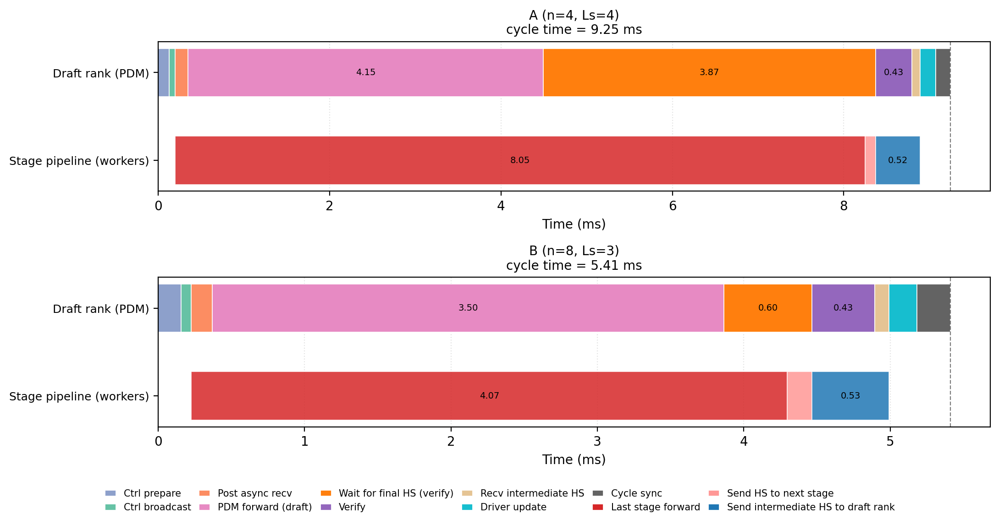

# Distributed Pipeline Inference

Multi-GPU **layer-wise pipeline parallel** inference for speculative pipeline decoding. Uses `torch.distributed` (NCCL) with one rank per pipeline stage plus a dedicated speculation rank on rank 0. This path measures **real wall-clock** prefill/decode time across devices (unlike single-process `eval.py`, which reports theoretical speedup from per-stage GPU timers).

## Requirements

- Linux, multiple NVIDIA GPUs, NCCL
- Same dependencies as the parent repo (`torch` 2.8+, `transformers`, FlashAttention 2)
- v11 speculation-head checkpoint (`config['version'] == 11`)

Published checkpoints use names like `Qwen3.5-4B_s{num_stages}_l{num_spec_layers}.pt` (for example `Qwen3.5-4B_s4_l4.pt`, `Qwen3.5-4B_s8_l4.pt`). See the [Hugging Face collection](https://huggingface.co/yuyijiong/speculative_pipeline_decoding) for downloads.

## Rank layout

`world_size = num_stages + 1`. Rank 0 runs speculation + embedding + final norm + lm head; ranks `1..num_stages` each hold one pipeline stage shard.

`--rank_gpus` is a comma-separated list of physical GPU ids, length = `world_size`. Rank `i` uses `rank_gpus[i]`. If omitted, each rank uses `LOCAL_RANK` from `torchrun`.

## Quick demo

Single node, 4 stages (5 GPUs):

```bash
CUDA_VISIBLE_DEVICES=0,1,2,3,4 torchrun --standalone --nproc_per_node=5 \
  distributed_inference/example_mp_pipeline_generate.py \
  --spec_head_ckpt Qwen3.5-4B_s4_l4.pt \
  --base_model_path Qwen/Qwen3.5-4B \
  --rank_gpus 0,1,2,3,4 \
  --prompt "Introduce LLM." \
  --max_new_tokens 128 \
  --temperature 0.0
```

Single node, 8 stages (9 GPUs):

```bash
CUDA_VISIBLE_DEVICES=0,1,2,3,4,5,6,7,8 torchrun --standalone --nproc_per_node=9 \
  distributed_inference/example_mp_pipeline_generate.py \
  --spec_head_ckpt Qwen3.5-4B_s8_l4.pt \
  --rank_gpus 0,1,2,3,4,5,6,7,8
```

If the checkpoint `config["base_model_path"]` already points to a valid Hugging Face id or local path, omit `--base_model_path`.

## Benchmark eval (real speed)

```bash
CUDA_VISIBLE_DEVICES=0,1,2,3,4 torchrun --standalone --nproc_per_node=5 \
  distributed_inference/eval_mp_pipeline_dataset.py \
  --spec_head_ckpt Qwen3.5-4B_s4_l4.pt \
  --base_model_path Qwen/Qwen3.5-4B \
  --data_dir eval_data \
  --output_dir ./eval_output_distributed \
  --rank_gpus 0,1,2,3,4
```

Multiple checkpoints (different `num_stages`) can be passed to `--spec_head_ckpt`; they are evaluated sequentially. On a single node, mismatched `world_size` triggers an automatic `torchrun` relaunch per checkpoint.

Outputs under `--output_dir`:

- `raw/mp_pipeline_eval__<checkpoint_tag>__nt<total>__per_sample.jsonl`
- `summary/mp_pipeline_eval__<checkpoint_tag>__nt<total>__summary.json`

Reports wall-clock prefill/decode timings, acceptance rate, equivalent accept length, and throughput (same datasets as `eval.py`: MT-Bench, HumanEval, GSM8K under `eval_data/`).

## Time profiling

SPD hides draft latency by overlapping the **Pipeline Draft Module (PDM)** on rank 0 with stage forwards on worker ranks. The built-in profiler measures where each steady-state decode cycle spends wall time — this is what backs the cycle-breakdown analysis in the [paper](https://arxiv.org/abs/2605.30852) (Figure: cycle wall breakdown).



**Steady-state (pipeline full) per-cycle wall-time breakdown** on Qwen3.5-4B for (A) $n{=}4$, $L_s{=}4$ and (B) $n{=}8$, $L_s{=}3$. PDM forward on the dedicated draft rank overlaps worker-side stage forward; fixed verification / transfer / control costs grow relatively as stages get shallower.

### Key findings (Qwen3.5-4B, $T{=}0$, `draft_top_k=1`)

| Config | $n$ | $L_s$ | Cycle wall (full pipe) | PDM forward | Slowest stage forward | PDM masking slack† |
| --- | ---: | ---: | ---: | ---: | ---: | ---: |
| A | 4 | 4 | 9.25 ms | 4.22 ms | 7.90 ms | 3.69 ms |
| B | 8 | 3 | 5.41 ms | 3.49 ms | 4.20 ms | 0.71 ms |

† `max_stage_forward − spec_forward` at full pipeline depth — margin by which stage compute outlasts PDM forward (draft latency masked).

- **Draft is not the cycle bottleneck.** PDM forward is shorter than the slowest stage forward on both configs; speculation stays off the critical path.
- **Verify dominates rank-0 serial time** at $n{=}4$ (~4.0 ms); it shrinks at $n{=}8$ (~1.2 ms) as stages get shallower.
- **Wider pipelines reduce cycle wall** (9.25 → 5.41 ms) but not by $2\times$, because every cycle carries fixed costs (verify, comm/sync, driver update) that do not shrink with stage depth. At $L_s{=}3$ ($L/n{-}1$ for $L{=}32$), PDM time is just below one stage forward — one more layer would re-expose draft latency on the critical path.

Scope: numbers above are **steady-state** steps where all $n$ stages are occupied (warm-up / fill cycles excluded). Two timer views are exported — **do not add them together**:

1. **Rank-0 serial timeline** — contiguous host phases whose sum equals `cycle_wall_sec` (control, PDM forward, verify, recv snaps, driver update, cycle sync).
2. **Worker instrumentation** — per-stage GPU forward times gathered at shutdown; runs **in parallel** with rank-0 work.

Full-pipe depth uses `overall_timing_profile.by_depth_ms.*[n-1]`; per-step averages over all depths use `mean_per_step_ms.*`. Phase semantics are defined in `decode.py` (`DecodeTimingBreakdown`).

### How to run

**Single-prompt demo** (`--profile_timing` on by default):

```bash
CUDA_VISIBLE_DEVICES=0,1,2,3,4 torchrun --standalone --nproc_per_node=5 \
  distributed_inference/example_mp_pipeline_generate.py \
  --spec_head_ckpt Qwen3.5-4B_s4_l4.pt \
  --rank_gpus 0,1,2,3,4 \
  --max_new_tokens 128 \
  --profile_timing
```

Prints an additive rank-0 phase table, per-stage forward times, and full-pipeline depth breakdown to stdout.

**Dataset eval** (profiling off by default for throughput; enable explicitly):

```bash
CUDA_VISIBLE_DEVICES=0,1,2,3,4 torchrun --standalone --nproc_per_node=5 \
  distributed_inference/eval_mp_pipeline_dataset.py \
  --spec_head_ckpt Qwen3.5-4B_s4_l4.pt \
  --data_dir eval_data \
  --output_dir ./eval_output_profiled \
  --rank_gpus 0,1,2,3,4 \
  --profile_timing \
  --prompts_per_dataset 3
```

When `--profile_timing` is set, each `summary/*.json` includes `overall_timing_profile` with `by_depth_ms` and `mean_per_step_ms` (same keys as the figure). Regenerate the paper plot from profiling summaries with `EMNLP2026/plot_cycle_wall_breakdown.py`.

### Rank-0 serial phases (steady state)

| Phase | Meaning |
| --- | --- |
| `ctrl_prepare` / `ctrl_broadcast` | Build and broadcast GO / control tensors |
| `post_recv` | Post async P2P receives for stage snaps |
| `spec_forward` | PDM forward (draft logits) |
| `recv_verify` | Wait for last-stage hidden state for verify |
| `verify` | CUDA-graph verify kernel + LM-head check |
| `recv_snap` | Wait for intermediate hidden states (aggregation) |
| `driver_update` | Pop finished slot, sample draft token, insert new pipeline entry |
| `cycle_sync` | End-of-cycle `p2p.wait_all()` (no per-cycle `dist.barrier`) |

## Module layout

| File | Role |
|------|------|
| `example_mp_pipeline_generate.py` | CLI: single-prompt generate + timing breakdown |
| `eval_mp_pipeline_dataset.py` | CLI: MT-Bench / HumanEval / GSM8K eval |
| `loader.py` | Per-rank model shards + spec head |
| `prefill.py` | Prompt prefill + KV shard distribution |
| `decode.py` | Decode loop (rank 0 driver + stage workers) |
| `rank0_controller.py` | Verify, speculation, snap fusion on rank 0 |
| `stage_worker.py` | Stage forward + P2P on worker ranks |
| `comm.py` | Pipeline P2P and control messages |
| `topology.py` | Rank ↔ stage mapping |
| `cache.py` | Per-stage KV cache shards |
| `cuda_graph_opts.py` | CUDA-graph verify path on rank 0 |

## Implementation notes (v11)

- **Fixed-wire snap protocol**: stage→rank0 snap batches use a fixed on-wire layout (no per-cycle meta tensors for snap indices), with pooled recv buffers reused across decode cycles.
- **Verify CUDA graph**: rank-0 verification can run inside a captured CUDA graph; `stage_input_sync` copies `verify_hs` on the default stream before replay, using stream-scoped sync so in-flight snap `irecv`s are not drained.
- **Cycle sync**: end-of-cycle synchronization is a single `wait_all()` on outstanding P2P ops (no per-cycle `dist.barrier`), keeping NCCL recv streams concurrent with verify work.
- **Timing**: see [Time profiling](#time-profiling) for cycle-breakdown methodology, paper numbers, and `--profile_timing` usage.

## Non-uniform stage partitioning (v12, exploratory)

Uniform SPD needs `num_stages + 1` ranks (PDM on its own rank), so `n=4` / `n=8` often spill past a single 4- or 8-GPU node.
**v12** checkpoints support uneven `stage_layers` in config: co-locate the PDM with a shallower first stage so the world size stays at 4 or 8, and overlap drafting with the remaining layers on other ranks after a shared first-stage barrier (`L_1` target layers).
This path is exploratory (preliminary theoretical numbers only; distributed wall-clock still incomplete). Load a v12 checkpoint the same way as above; the loader reads `config['version'] == 12` and `stage_layers` automatically.

## Notes

- All ranks must `barrier` after model load before decoding; otherwise P2P can hang.
- v11 checkpoints use uniform stage splits; v12 supports uneven `stage_layers` as above.
